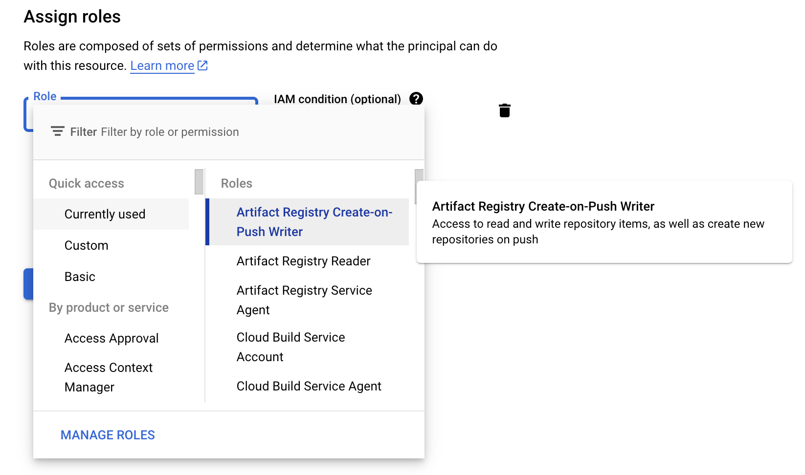
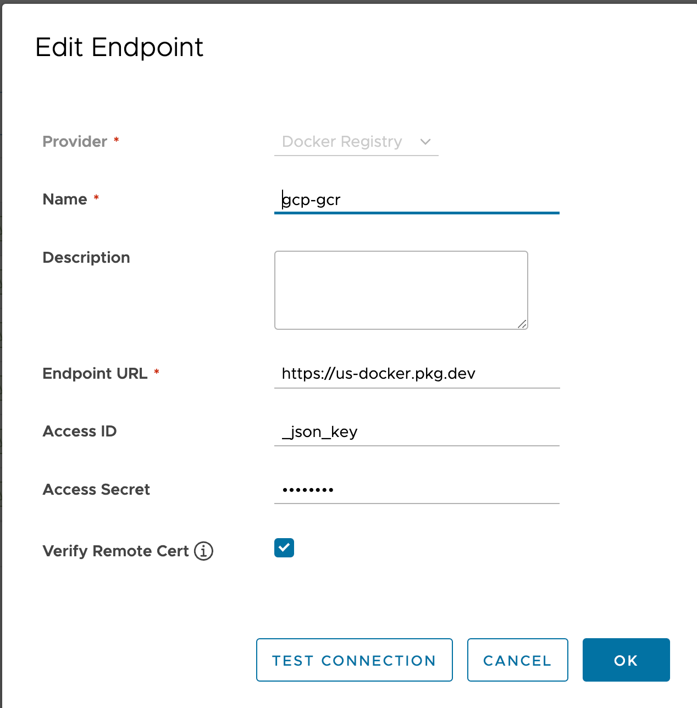
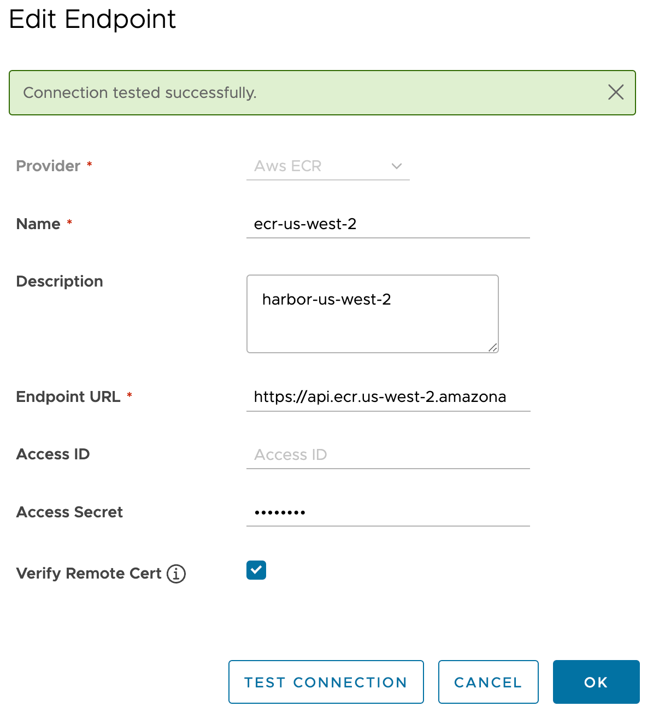
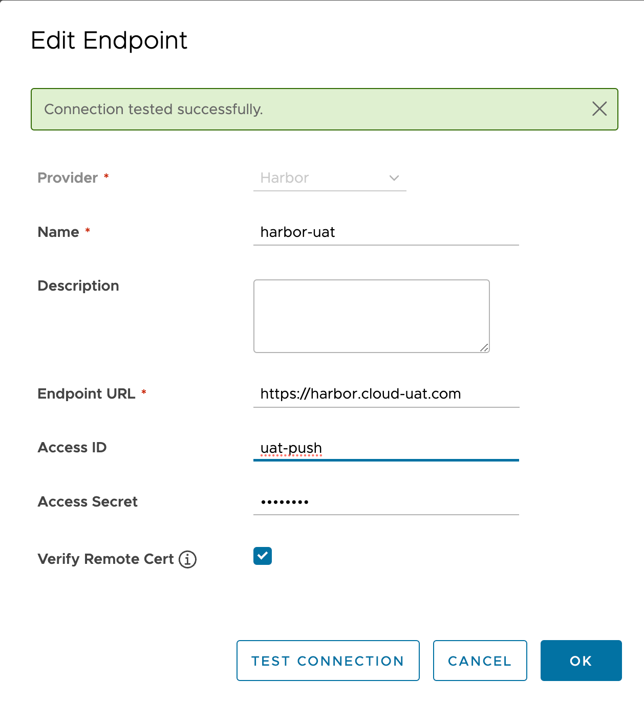

# Harbor replica image to cloud registry

## GCP Artifact Registry

### login gcr
```bash
gcloud auth print-access-token | docker login -u oauth2accesstoken --password-stdin https://us-docker.pkg.dev
```

### Harbor Replica to GCR
Refer: https://github.com/goharbor/harbor/issues/16973

Create gcp SA with the role


Config the Registies with `_json_key` and test connections



## AWS ECR
Create user and aksk in AWS IAM
### Policies:
policy 1: AmazonEC2ContainerRegistryFullAccess - managed by aws

policy 2: S3 policy:
```json
{
    "Version": "2012-10-17",
    "Statement": [
        {
            "Sid": "VisualEditor1",
            "Effect": "Allow",
            "Action": "s3:*",
            "Resource": "arn:aws:s3:::harbor-us-west-2/*"
        }
    ]
}
```
Config ECR registry with aksk



## Harbor to Harbor




